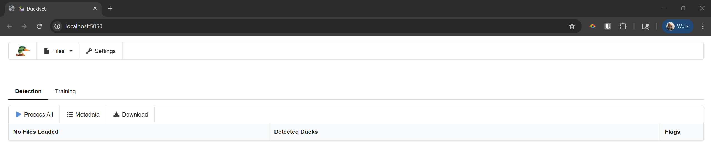
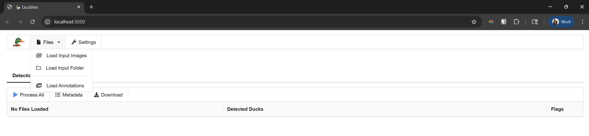
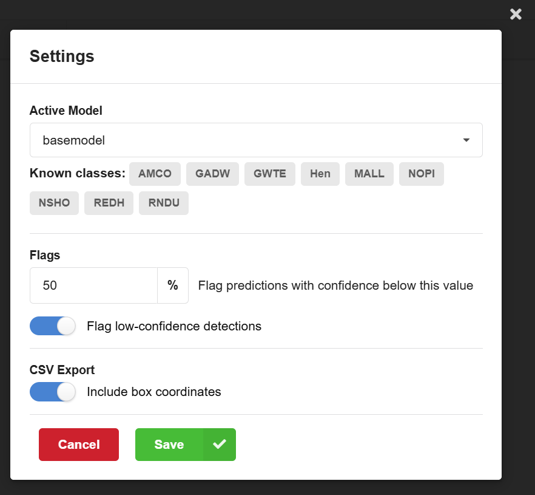
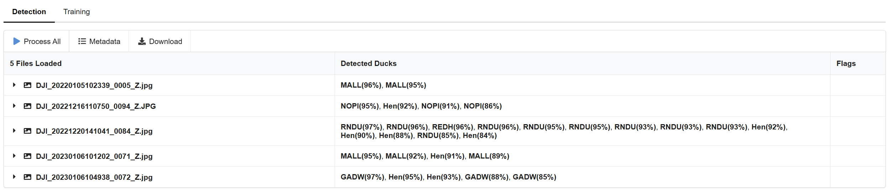
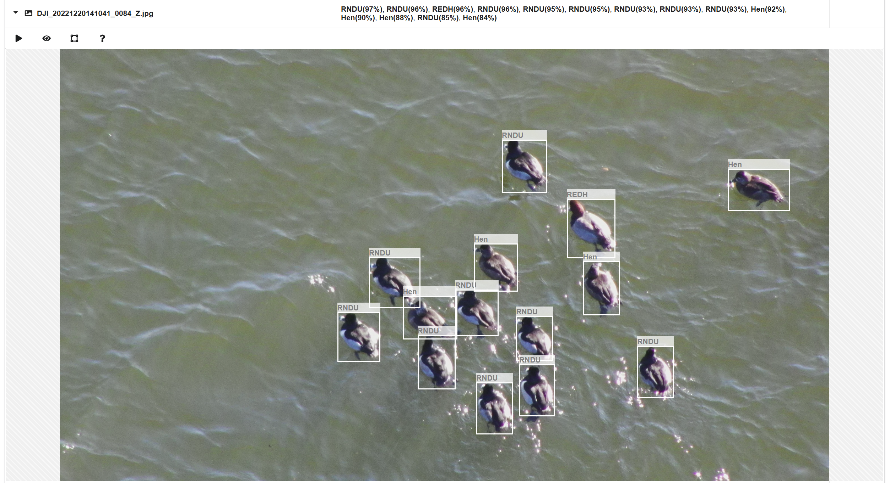
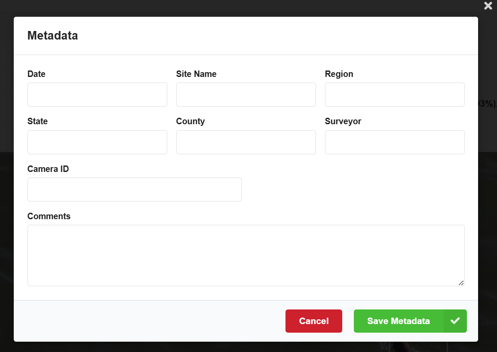
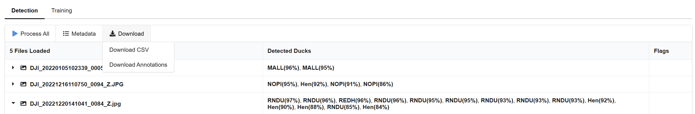
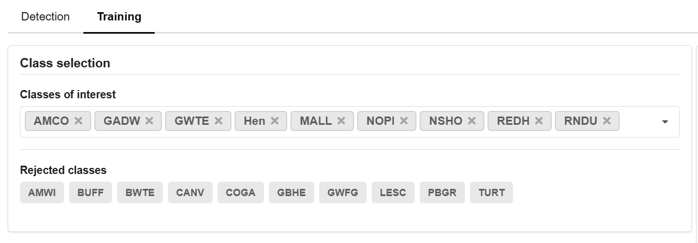
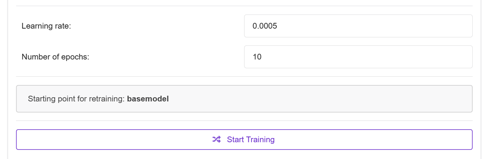

# 🦆 DuckNet

**DuckNet** is an open-source, deep learning-based tool for detecting, localizing, and classifying waterbird species in drone imagery. It adapts the excellent work of [BatNet](https://github.com/GabiK-bat/BatNet).

DuckNet allows users to process custom UAV image datasets using a baseline model developed by Loken et al. (2025). The baseline model—**RetinaNet** with a **ResNet-50** backbone—is trained to identify:

- **Seven drake (male) waterfowl species**:  
  - Gadwall (*Mareca strepera*)  
  - Green-winged teal (*Anas carolinensis*)  
  - Northern pintail (*Anas acuta*)  
  - Northern shoveler (*Spatula clypeata*)  
  - Mallard (*Anas platyrhynchos*)  
  - Redhead (*Aythya americana*)  
  - Ring-necked duck (*Aythya collaris*)
- **A hen (female) waterfowl class** (species-agnostic)
- **American coot** (*Fulica americana*)

Users can fine-tune the baseline model with custom, annotated drone imagery to add additional species, distinguish between life stages (e.g., juvenile vs. adult), or identify different plumage types (e.g., breeding vs. non-breeding). Any visual distinction that can be captured in a UAV image and represented by a labeled bounding box is supported.

DuckNet includes:

- An integrated **annotation interface** for labeling data (outputs LabelMe-format JSON)
- Support for importing existing LabelMe-format annotation files
- Tools to save fine-tuned models for future reuse

---

## Installation and Setup

### Prerequisites
- **Docker Desktop** installed on your system ([Download here](https://www.docker.com/products/docker-desktop/))
- NVIDIA GPU for cuda support (optional, for faster processing)

### Quick Start
```bash
# Pull and run the DuckNet container
docker run -d -p 5050:5050 --name ducknet zjloken/ducknet:latest

# For GPU support (recommended):
docker run -d -p 5050:5050 --gpus all --name ducknet zjloken/ducknet:latest
```

### Stop/Start Container
```bash
# Stop DuckNet
docker stop ducknet

# Start DuckNet again
docker start ducknet

# Remove container completely
docker rm ducknet
```

---

## Usage

### Running DuckNet with Graphical User Interface

The user-friendly GUI allows you to combine automated species identification with manual review of low-confidence predictions.

**Step 1. Opening DuckNet:** After running the Docker container, open your web browser and navigate to `http://localhost:5050`. The DuckNet interface will load automatically. 



**Step 2. Loading drone camera images:** Under the `Files` tab, select *Load Input Images* to load images one-by-one from a folder, or select *Load Input Folder* to load all images from the selected folder. If you load 1000+ images, it might take a few minutes to load all images. A list of all loaded images will appear below.



**Step 3. Settings:** Under the `Settings` tab choose the *Active model* used for processing the images (default is the baseline model pre-trained on North American waterfowl species) and see the species (Known classes) that the model can identify; choose the *Confidence threshold*, below which all predictions will be flagged (default 60%); choose if the coordinates of the bounding boxes should be included in the final csv output file (default is YES); save settings or cancel.



**Step 4. Process the images:** Click on `Process All` to process all loaded images. After processing each image, the species identification(s) and their associated confidence level appear in the `Detected Ducks` tab. In the `Flags` tab the following flags are added: white flag – empty image, no ducks detected in the image; black flag – low-confidence identification, confidence level of species identification is below the set threshold (default 50%, change in the `Settings` tab).



**Step 5. Review the detections and identifications:** Clicking on a species identification or filename will open the original image, showing a bounding box around each detected duck and the corresponding species identification. Hovering over the species label will show the confidence level of the identification. Images can be sorted based on the confidence level of their identifications, allowing users to quickly review all images below the chosen confidence threshold. Identifications can be removed by clicking on the red X in the upper right corner of each bounding box. Bounding boxes can be resized by pulling the lower right corner of the box and can be moved around by the grey square in the middle of the bounding box. For each image a menu bar appears on the top left corner with four icons:
- Click on the first icon (black triangle) to process the image.
- Clicking on the second icon (eye) allows you to show/hide the bounding boxes from an image (e.g. when multiple identifications are overlapping), and change the brightness of the image.
- The third icon (bounding box) allows you to add new bounding boxes with species identification to the image (from a drop-down menu or by typing species class), when ducks were not detected in the image.
- The fourth icon (question mark) is a summary of short keys: shift + drag to move the image, shift + mouse wheel to zoom and shift + double-click to reset the image.



**Step 6. Add Metadata (optional):** This metadata information will be included in the beginning of the csv output file, but it can be left empty. Included fields: date, site name, region, county, surveyor, camera ID, and comments; save metadata or cancel.



**Step 7. Download results:** Under the `Download` tab you can download the results as a csv file (*Download CSV*) or you can download the bounding boxes as json files to be used as training images (*Download Annotations*). Clicking on the download button will prompt a window to choose the location where the files should be saved. The default filename for the csv file is *detected_ducks.csv*, annotations are saved as the image names with json extension.

The output csv file contains the following columns: file name, date when image was taken, time when image was taken, class (four letter species code), confidence level (on a scale from 0-1), and, optionally, bounding box coordinates (XYXY format).



### Retraining DuckNet

**Step 1.** Under the `Files` tab, select *Load Input Images* to load selected images from a folder or select *Load Input Folder* to load all images in a folder. A list of all loaded images will appear below.

**Step 2.** Under the `Files` tab, select *Load Annotations* and select all corresponding json files that contain the correct bounding box locations and species labels. Annotation files must be in LabelMe format.

**Step 3.** Click on the `Training` tab and select *Classes of Interest* (duck species that should be identified) and *Rejected classes* (classes to ignore).



**Step 4.** Set the learning rate (default 0.0005) and the number of epochs (default 10) and click on `Start training`. Important: this may take up to several hours or days, depending on the number of training images and your computer performance. After the training finishes, save the model. To apply the new model, change the *Active model* under the `Settings` tab.



**It is highly recommended that before ecological inference users test the model performance (both the baseline or the new, retrained) on a subsample of manually identified drone camera images to uncover possible hidden or new biases. Please see the publication linked below for more details.**

---

## Citation

Loken, Z. J., Ringelman, K. M., Mini, A., James, D., & Mitchell, M. (2025). *DuckNet: an open-source deep learning tool for waterfowl species identification in UAV imagery.* Remote Sensing in Ecology and Conservation. https://doi.org/10.1002/rse2.70028

- **Corresponding author**: Zack Loken (zack@savannainstitute.org)  
- **Lead developer**: Mike Mitchell (mmitchell@ducks.org)

---

## License

[![CC BY-NC-SA 4.0][cc-by-nc-sa-shield]][cc-by-nc-sa]

The DuckNet application is licensed under a [Creative Commons Attribution-NonCommercial-ShareAlike 4.0 International License][cc-by-nc-sa].

[![CC BY-NC-SA 4.0][cc-by-nc-sa-image]][cc-by-nc-sa]  

[cc-by-nc-sa]: http://creativecommons.org/licenses/by-nc-sa/4.0/  
[cc-by-nc-sa-image]: https://licensebuttons.net/l/by-nc-sa/4.0/88x31.png  
[cc-by-nc-sa-shield]: https://img.shields.io/badge/License-CC%20BY--NC--SA%204.0-lightgrey.svg

---

## Disclaimer

DuckNet is a free, open-source software without any warranty. You are highly recommended to test the ability of the baseline model (or retrained models) to classify images in your drone image dataset and not assume that the here reported accuracy will be found on your images. The authors of this paper are not responsible for any decisions or interpretations that are made using DuckNet.